# 프로젝트 개요
 

여성안심 귀갓길은 이름 그대로 여성들이 안심하고 귀가할 수 있도록 제정된 길을 말한다.

하지만 만들어진 취지와는 달리 귀갓길에 설치된 방범 시스템들은 제대로 관리되지 않고 있거나 활성화되지 않은 경우가 더러 있었고 시스템 자체의 한계가 존재한다.

CCTV의 영상 관제만으로는 사각지대가 있고 객체 간의 간섭이 있을 경우 인식에 어려움이 있으며, 비상벨은 실제 설치된 장소도 적을뿐더러 연결 불량인 경우가 다반사였다.

이러한 문제들을 살펴보면서 우리는 기존 방범 시스템들의 한계를 극복하고 여성들의 불안감을 해소하기 위해 피해자의 신고 없이도 즉각 상황 전달이 가능한 새로운 방범 시스템의 개발이 필요하다고 생각했고, **인공지능이 여성안심 귀갓길에서 발생하는 소리를 인식하고 소음의 종류를 판단 및 분석하여 실시간으로 위험 상황을 파악해 신고하는 기기**를 제작하고자 하였다.

   

# 벤치마킹
 

| 제품 | 장점 | 단점 |
|:---:|:---:|:---:|
| 벨시스 비명감지기 | 1. 비명 소리가 인식되면 외부의 경광등이 작동되어 상황이 발생함을 알림   2. 비명 인식 후, 비상통화로 연결해 주는 IoT 시스템 탑재 | 1. 경광등 알림이기 때문에 순찰이 없는 경우 발견이 늦음   2. 설치해야 하는 기기가 많아 공간의 제약이 있음   3. 통화로 상황 설명을 하지 못하는 경우가 있을 수 있음 |
| 안심이 | 1. 긴급 신고 버튼을 누르면 사이렌 소리가 울림   2. 서비스를 활성화하면 인근의 CCTV를 통해 모니터링이 가능함 | 1. CCTV가 없는 곳에선 모니터링 자체가 불가능함   2. 앱을 실행시킬 수 없는 경우가 있을 수 있음 |

 

| 개선 방안 |
|:---|
| **< 자동 신고 기능 반영 >**   - 인공지능이 위급 상황으로 판단 후 즉시 관제 시스템으로 해당 GPS 정보와 신고 알림이 전송되도록 함   - 실제 상황 발생 시 피해자의 유연한 대처가 어려워 정확한 상황 전달에 한계가 있는 경우에도 별다른 조치 없이 상황 전달 및 신고가 가능하도록 함|
| **< 개인정보 보호 >**   - 모든 데이터가 아닌 위험 상황 판단 후 실제 신고까지 넘어간 사례일 경우 즉, 비명 트리거에만 한정하여 데이터를 저장하도록 하여 기존 시스템의 개인정보 유출로 인한 보복, 사생활 침해 등의 문제점을 해결하도록 함 |
| **< 공간 제약 및 관제 제한 해소 >**   - 작은 크기로 제작하여 협소 공간에도 설치가 가능하도록 함   - 사각지대의 제약을 해결하도록 함   - 영상 관제가 불가능한 장소(화장실, 탈의실)에도 활용할 수 있도록 함|

   

# 결과물
 

- **speaker case rendering**
  
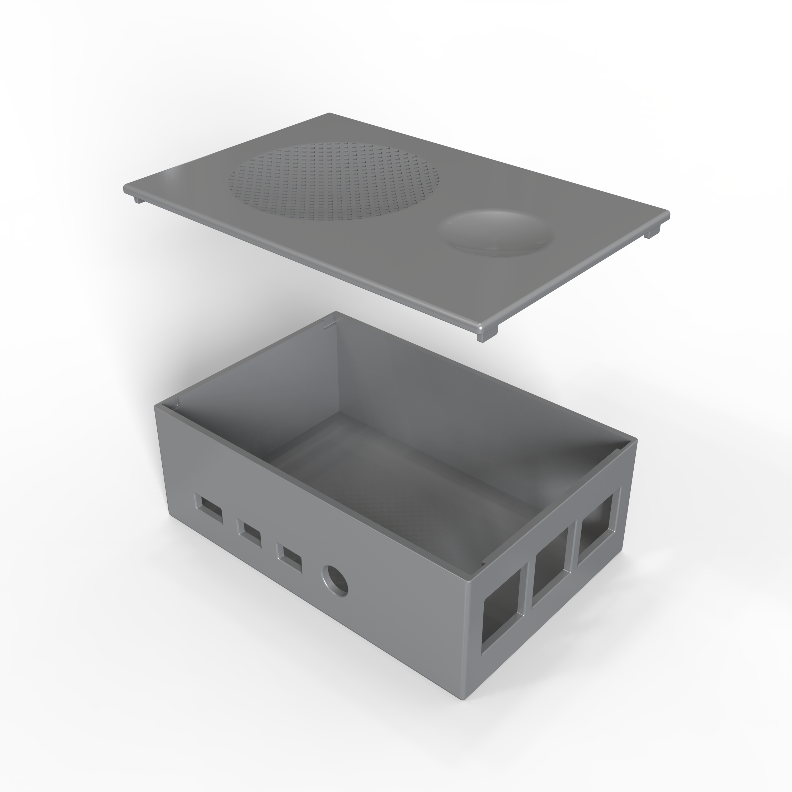

  

- **speaker case**
  
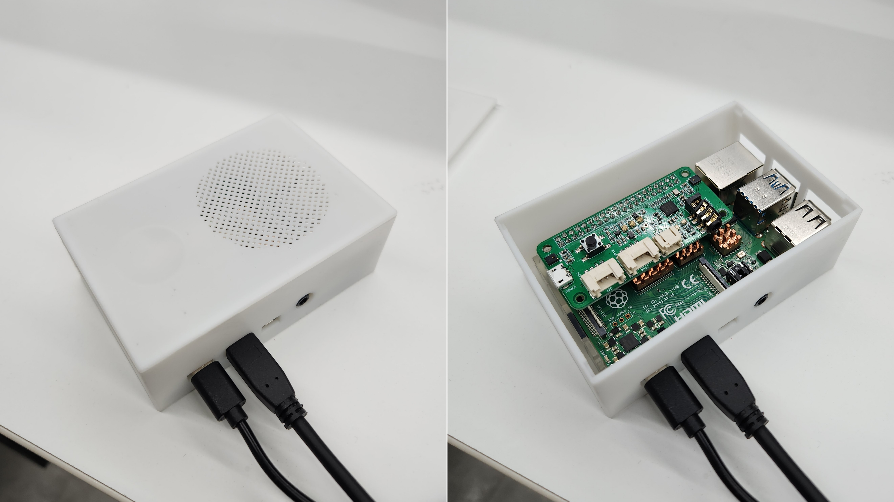

  

- **관제 메인 페이지**

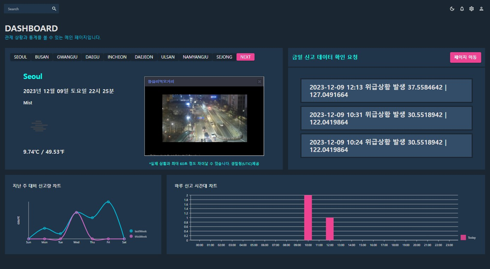

>1. 경찰청(UTIC)에서 제공한 API를 활용하여 18개 지역의 실시간 CCTV 영상과 날씨 및 온도를 제공함
>2. 금일 들어온 미확인 신고 데이터 목록을 제공함. 페이지 이동 버튼을 눌러 상세 페이지로 이동 가능
>3. 지난주 대비 신고량 차트를 제공함
>4. 하루 시간대별 신고량 차트를 제공함

  

- **보호 구역 페이지**

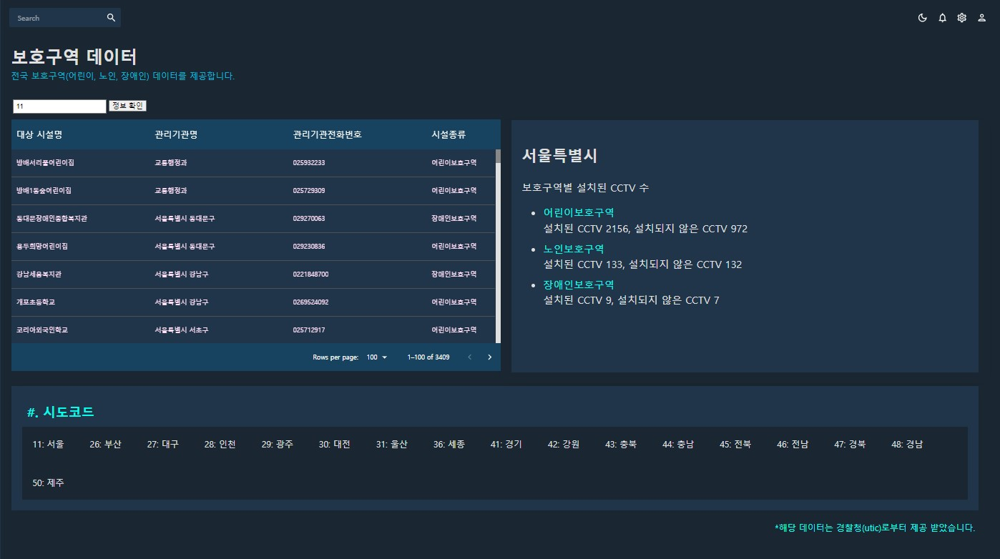

>1. 경찰청(UTIC)으로부터 지급받은 API_KEY 값을 지정하고, 시도 코드를 입력해 정보 확인 버튼을 누르면 해당 값이 경로에 들어가 입력된 시의 데이터 목록을 볼 수 있음
>2. 각 구역마다 CCTV를 설치한 수와 설치되지 않은 수를 알 수 있음
>3. 시도 코드 정보 제공

  

- **안심 귀갓길 페이지**

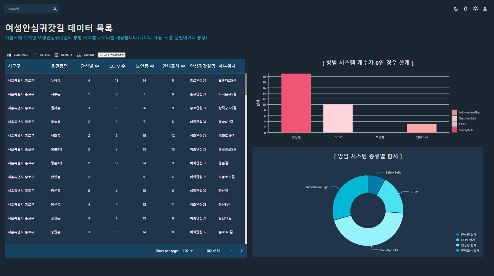

>1. 여성안심 귀갓길 데이터를 확인할 수 있고 CSV 파일로 다운로드 가능해 간편하게 데이터 관리가 가능함
>2. 방범 시스템의 개수가 0인 경우를 그래프를 통해 알 수 있음
>3. 방범 시스템의 종류별 개수를 그래프를 통해 알 수 있음

  

- **지킴이집 페이지**

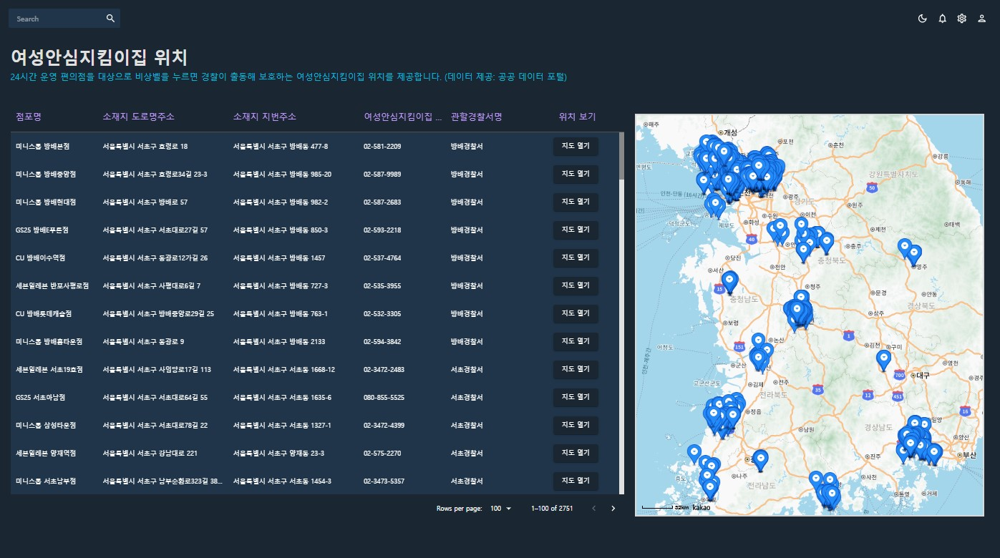

>1. 공공 데이터 포털에서 제공한 데이터를 DB에 저장하고 json 파일 형태로 데이터를 불러옴. 여성안심 지킴이집 데이터를 확인할 수 있고 지도 열기 버튼을 눌러 상세 정보 및 위치 조회가 가능함
>2. 카카오맵 API를 사용하여 지킴이집의 전국 각 위치와 분포도를 확인할 수 있음

  

- **경찰관서 페이지**

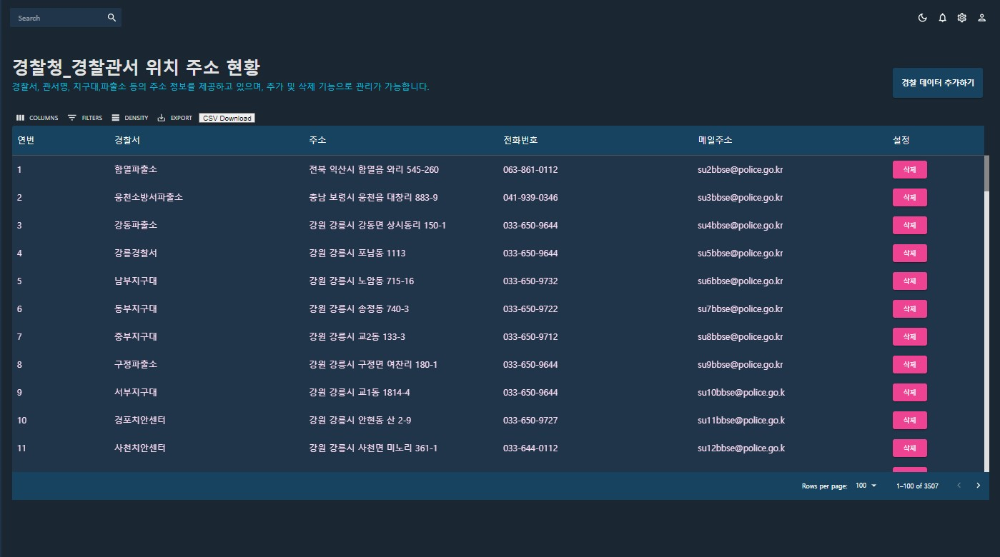

>1. 공공 데이터 포털에서 제공한 데이터를 DB에 저장해 json 파일로 받아 제공하고 있음
CSV 파일로 다운로드 가능함
>2. 추가 및 삭제 버튼을 통해 데이터 관리가 가능함(DB와 연동)

  

- **신고 수신 페이지**

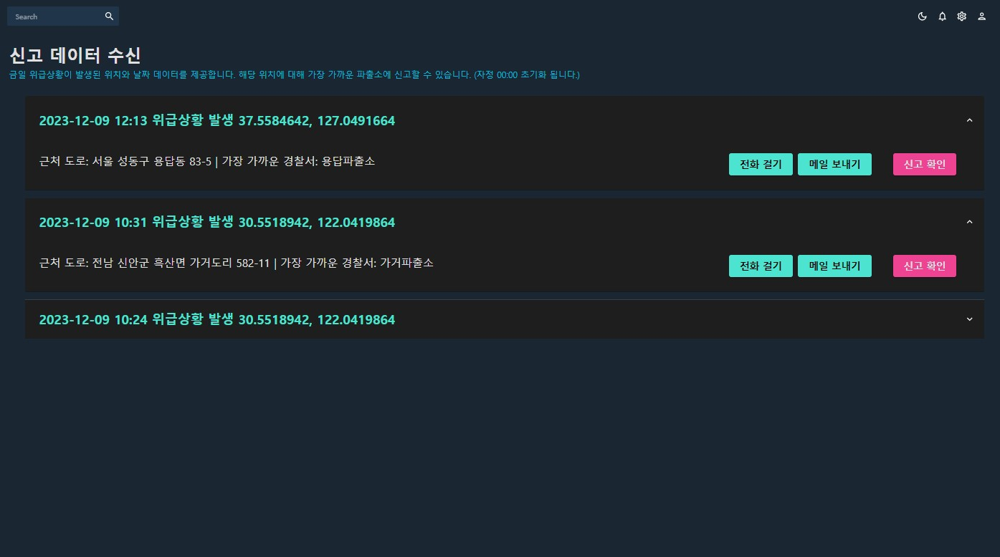

>1. 발생 날짜와 시간, GPS 모듈을 통해 위도와 경도 데이터를 받음
DB에 있는 경찰서의 위도와 경도를 비교해 가장 가까운 경찰서의 정보를 연동함
>2. 전화 걸기 및 메일 보내기 버튼을 통해 해당 경찰서로 신고하는 기능이 열림
>3. 신고 확인 버튼을 통해 처리 완료 가능함

  

- **신고 게시판 페이지**

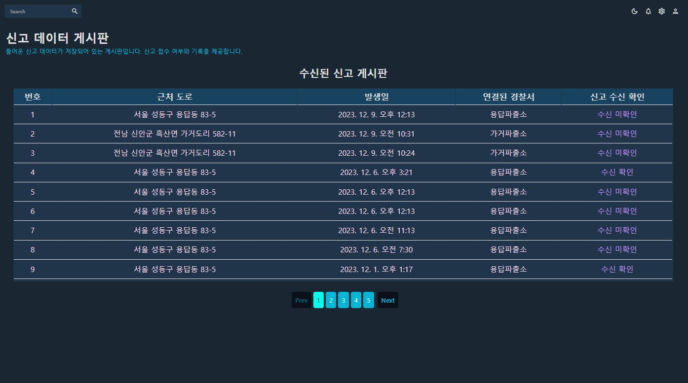

>1. 신고 확인 페이지에서 처리한 신고 내용과 들어온 신고 데이터, 연결된 경찰서의 데이터 등이 게시판에 저장됨
관리자가 신고 조치를 한 경우 접수 상태가 되고, 조치를 하지 않았거나 하루가 지난 경우 미접수 상태로 구분됨

  

- **통계 차트 페이지**

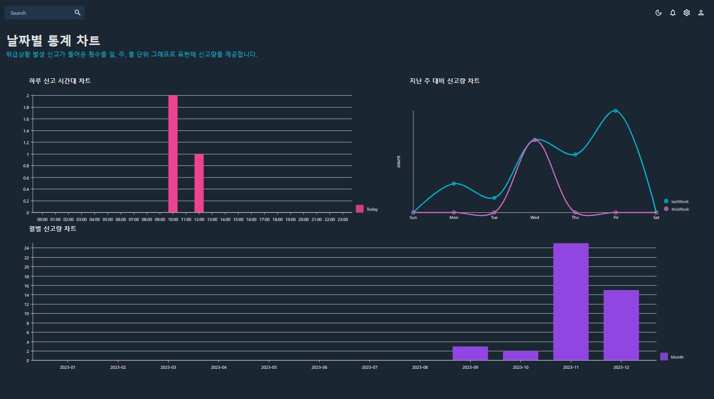

>1. 하루 동안 들어온 신고 데이터를 시간대별로 볼 수 있음
>2. 지난주와 신고량을 비교해서 볼 수 있음
>3. 월별로 신고량을 비교해서 볼 수 있음

  

- **신고 알람 팝업 페이지**

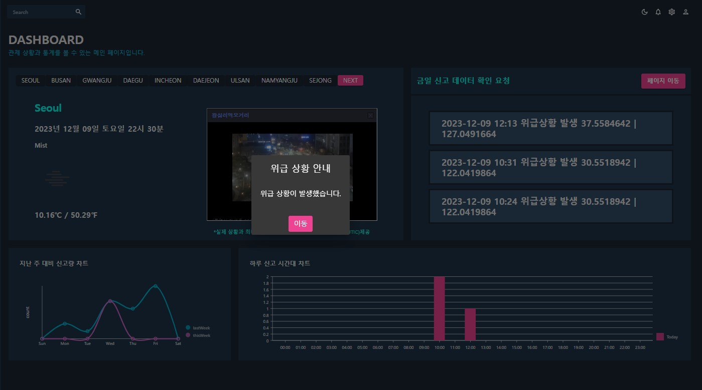

>1. 인공지능으로부터 위급 상황이 판단되어 결과가 서버로 들어오면 동시에 신고 알람 팝업창이 열림

